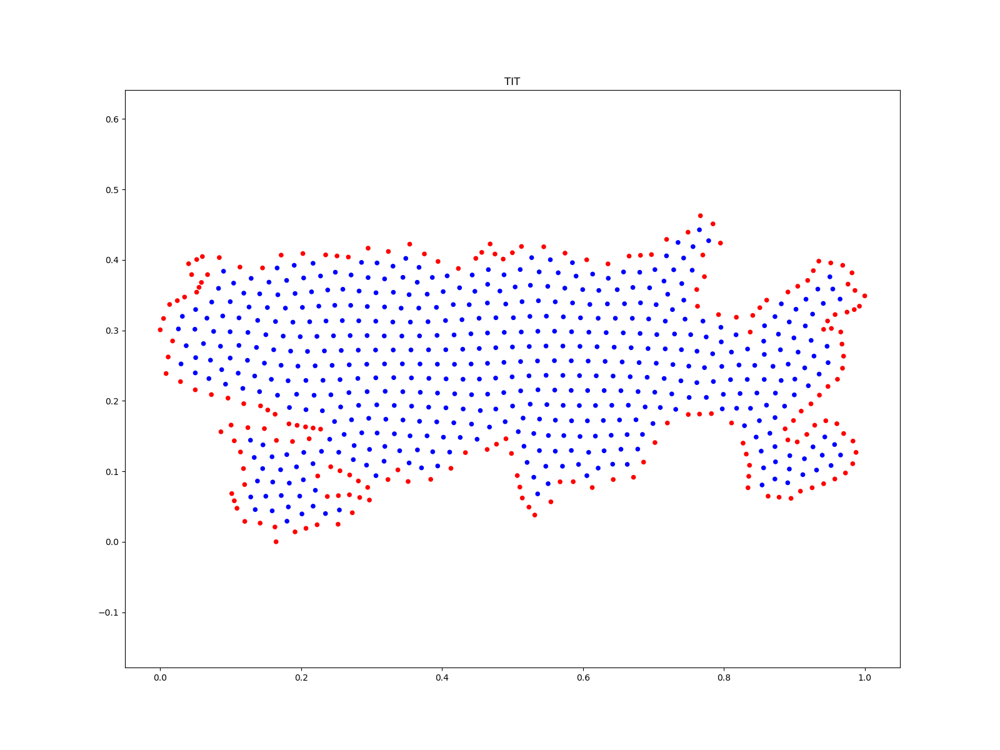

# mGFD
Data and methods for numerically solve Advection-Diffusion Equation using a meshless Generalized Finite Differences Scheme.

All the codes are distributed under MIT License on [GitHub](https://github.com/gstinoco/mGFD) and are free to use, modify, and distribute giving the proper copyright notice.

## Description :memo:
This repository proposes a way to achieve an approximation to Advection-Diffusion Equation in two dimensions for highly irregular regions.

For this, the proposed method uses a Generalized Finite Differences Method for the numerical solution on unstructured clouds of points.

Examples of solving various problems in an irregular region can be found below.

| Titicaca Lake Cloud of Points                                                                        | Titicaca Lake Cloud of Points with Holes      |                                                      
| :--------------------------------------------------------------------------------------------------: | :-------------------------------------------:                                                        |
|                                                                       |                                                                        |
|                                                                                                      |                                                                                                      |
| Unstructured Clouds of points                                                                        | Unstructured Clouds of points with holes                                                             |
| <video src="https://github.com/gstinoco/mGFD/assets/111999346/f3ace4e7-de20-4420-a492-8bea4be77d9d"> | <video src="https://github.com/gstinoco/mGFD/assets/111999346/8226f148-2086-4dbe-85e5-597ba4ed8498"> |
| $\mid\mid e\mid\mid = 8.682520100538671e-07$                                                         | $\mid\mid e\mid\mid = 5.293394861064519e-07$                                                         |

## Data :open_file_folder:
All the data were taken from Author's [Cloud-Generation Github Repository](https://github.com/gstinoco/Cloud-Generation). The data is free for anyone to use to compare the results using different methods with the same dataset.

The following regions were considered for this repository:
- **BAN**: Banderas bay in Mexico.
- **BLU**: Blue Lagoon in Iceland.
- **CUA**: Unitary square.
- **CUI**: Cuitzeo Lake in Mexico.
- **ENG**: United Kingdom Island.
- **GIB**: Strait of Gibraltar.
- **HAB**: Havana bay.
- **MIC**: Michoacan State in Mexico.
- **PAT**: Patzcuaro Lake in Mexico.
- **TIT**: Titicaca Lake in South America.
- **TOB**: Toba Lake in Indonesia.
- **UCH**: Uchinskoye Reservoir in Russia.
- **VAL**: Valencia Lake in Spain.
- **ZIR**: Zirahuen Lake in Mexico

## How to :microscope:
The codes are self explained and completely documented. Examples on how to perform approximations can be found on the files that approximate the following conditions:
- **Example_1.py**:
$$f(x, y, v, a, b, t) = \left(\frac{1}{4t + 1}\right)\exp\left(-\frac{(x - at - 0.5)^2}{v(4t + 1)} - \frac{(y - bt - 0.5)^2}{v(4t + 1)}\right)$$

- **Example_2.py**:
$$f(x, y, v, a, b, t) = \frac{1}{4\pi v t + 1} \exp\left(-\frac{(x - a t)^2 + (y - b t)^2}{4v t + 1}\right)$$

- **Example_3.py**:
$$f(x, y, v, a, b, t) = \sin(\pi (x - a t)) \cdot \sin(\pi (y - b t)) \cdot \exp(-v t)$$

- **Example_4.py**:
$$
f(x, y, v, a, b, t) = \left\{
  \begin{array}{ll}
    1 & \text{if } 0.2 < x - a t < 0.8 \text{ y } 0.2 < y - b t < 0.8 \\
    0 & \text{otherwise.}
  \end{array}\right.
$$

- **Example_5.py**:
$$f(x, y, v, a, b, t) = \exp\left(-\frac{(x - a t)^2 + (y - b t)^2}{4v t + 1}\right) \cdot \mathbf{1}(x^2 + y^2 \leq 0.25)$$

- **Example_6.py**:
$$f(x, y, v, a, b, t) = \exp\left(-100 \cdot ((x - 0.5 - a t)^2 + (y - 0.5 - b t)^2)\right) \cdot \exp(-v t)$$

- **Example_7.py**:
$$f(x, y, v, a, b, t) = \mathbf{H}(0.5 - (x - a t)) \cdot \mathbf{H}(0.5 - (y - b t))$$

These examples can be easily modified to perform approximations with different conditions and coefficients.

## Researchers :scientist:
All the codes presented were developed by:
    
  - **Dr. Gerardo Tinoco Guerrero** 
    Universidad Michoacana de San Nicolás de Hidalgo 
    Aula CIMNE-Morelia 
    gerardo.tinoco@umich.mx 
    https://orcid.org/0000-0003-3119-770X

  - **Dr. Francisco Javier Domínguez Mota** 
    Universidad Michoacana de San Nicolás de Hidalgo 
    Aula CIMNE-Morelia 
    francisco.mota@umich.mx 
    https://orcid.org/0000-0001-6837-172X

  - **Dr. José Alberto Guzmán Torres** 
    Universidad Michoacana de San Nicolás de Hidalgo 
    Aula CIMNE-Morelia 
    jose.alberto.guzman@umich.mx 
    https://orcid.org/0000-0002-9309-9390

  - **Dr. José Gerardo Tinoco Ruiz** 
    Universidad Michoacana de San Nicolás de Hidalgo 
    jose.gerardo.tinoco@umich.mx 
    https://orcid.org/0000-0002-0866-4798

## Students :man_student: :woman_student:
  - **Heriberto Arias Rojas** 
    Universidad Michoacana de San Nicolás de Hidalgo 
    heriberto.arias@umich.mx 
    https://orcid.org/0000-0002-7641-8310

  - **Gabriela Pedraza Jiménez** 
    Universidad Michoacana de San Nicolás de Hidalgo 
    2220157h@umich.mx 
    https://orcid.org/0009-0002-8118-0260
  
  - **Miguel Ángel Rodríguez Velázquez** 
    Universidad Michoacana de San Nicolás de Hidalgo 
    miguel.rodriguez@umich.mx 
    https://orcid.org/0009-0009-7245-1517
  
  - **Ricardo Román Gutiérrez** 
    Universidad Michoacana de San Nicolás de Hidalgo 
    ricardo.roman@umich.mx 
    https://orcid.org/0000-0001-8521-9391

<!--
  - **Nancy Saray Saucedo León** 
    Universidad Michoacana de San Nicolás de Hidalgo 
    1153558a@umich.mx 
-->
## Funding :dollar:
With the financing of:

  - National Council of Humanities, Sciences and Technologies, CONAHCyT (Consejo Nacional de Humanidades, Ciencias y Tecnologías, CONAHCyT), México.
  
  - Coordination of Scientific Research, CIC-UMSNH (Coordinación de la Investigación Científica de la Universidad Michoacana de San Nicolás de Hidalgo, CIC-UMSNH), México.
  
  - Aula CIMNE-Morelia, México.
